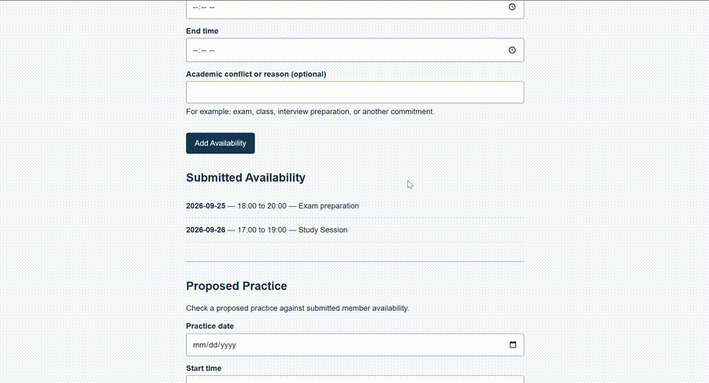
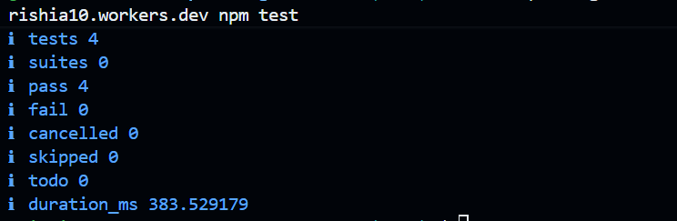

# Member Availability — Practice Conflict Detection

## What

This project helps competitive dance-team members protect academic commitments by recording times when they are unavailable for practice. The project context is documented in [PROJECT.md](context/PROJECT.md), and the feature specifications are in [FEATURES.md](context/FEATURES.md).

HW5 adds the delegated **F-07 Practice Conflict Detection** feature. A user can enter a proposed practice date and time and check it against submitted member availability. The feature reports overlapping conflicts, reports when no conflicts exist, rejects missing required practice fields, and rejects an end time that is not after the start time.

Member availability remains stored remotely through the existing Cloudflare Worker and D1 architecture rather than browser-only or parallel storage.

Previous stage: [HW4 repository](https://github.com/RishiA10/mgt3745-hw4)

## See It Work

F-07 was manually verified for all four specified behaviors:

- overlapping proposed practice identifies the conflicting availability;
- non-overlapping proposed practice reports no conflicts;
- missing required practice input is rejected with an explanation;
- an end time that is not later than the start time is rejected with an explanation.

Automated verification also passes **4 of 4 tests**.

## How to Run

The live Worker used by the application is:

`https://mgt3745-hw4.rishia10.workers.dev`

To run the page in a Codespace:

1. Open this repository in a GitHub Codespace.
2. Run `python3 -m http.server 8000`.
3. Open the forwarded port 8000 page.
4. Submit member availability or use the Proposed Practice form to check for conflicts.

To run the automated verification:

`API=https://mgt3745-hw4.rishia10.workers.dev npm test`

## Status

F-07 verification status: **4 of 4 EARS rows PASS**.

Automated test status: **4 passed, 0 failed**.

The complete success criteria, prediction stake, stake resolution, and error log are recorded in [EVALS.md](context/EVALS.md).

## Links

Recommended reading order:

[PROJECT.md](context/PROJECT.md) → [USERS.md](context/USERS.md) → [FEATURES.md](context/FEATURES.md) → [ARCHITECTURE.md](context/ARCHITECTURE.md) → [STANDARDS.md](context/STANDARDS.md) → [TOOLS.md](context/TOOLS.md) → [STYLE.md](context/STYLE.md) → [EVALS.md](context/EVALS.md) → [SKILLS.md](context/SKILLS.md)

### Delegation

- [DDR-001 — Bolt delegation](docs/ddr/DDR-001.md)
- [DDR-002 — Retroactive HW4 Copilot record](docs/ddr/DDR-002.md)
- [DDR-003 — ChatGPT HW5 guidance](docs/ddr/DDR-003.md)
- [DDR-004 — Google AI Studio Build comparison](docs/ddr/DDR-004.md)
- [Cross-tool comparison](COMPARISON.md)
- [Two-grader judgment](docs/JUDGMENT.md)
- Original Bolt artifact: `delegated/bolt-001.zip`

## AI Use

AI use and verification are documented in the DDRs linked above. Bolt was used for the delegated F-07 build, Google AI Studio Build was used for the required cross-tool comparison, ChatGPT was used for HW5 guidance and troubleshooting, and DDR-002 records the surviving evidence concerning Copilot from HW4.

Approximately **2.5 hours** had been spent on HW5 at the time the ChatGPT delegation record was created. AI-generated output was treated as untrusted until reviewed or tested, and unresolved verification limits are recorded in the applicable DDR and EVALS error log.
